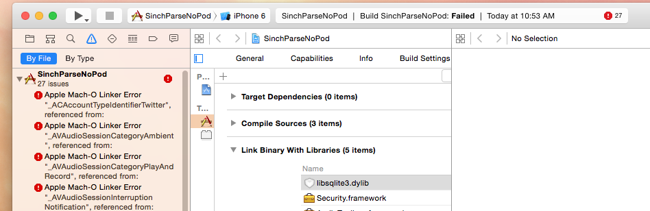

# Using sinch with parse the -ObjC flag and other issues you might run into

In this post we are going to deal with the -ObjC flag that Sinch SDK requires and what to do when you also want to integrate the wonderful service Parse.

Let me start by saying, the easiest way by far to use Sinch on its own and parse on its own is to use it with cocoa pods. And using parse and Sinch together is a lot easier also with cocoa-pods. You should get no errors what so ever using us together while using pods.

## What if I don't want to or can't use pods?
Well its certainly possible to use both of our frameworks together. Sinch along with many other frameworks require the -ObjC flag to bet set. Parse have some dependencies on bold and implicit on Facebook with causes some problems with -ObjC flag, dependencies on Facebook and What is ObjC flag?

> This flag causes the linker to load every object file in the library that defines an Objective-C class or category. While this option will typically result in a larger executable (due to additional object code loaded into the application), it will allow the successful creation of effective Objective-C static libraries that contain categories on existing classes.
 
source: [https://developer.apple.com/library/mac/qa/qa1490/_index.html](https://developer.apple.com/library/mac/qa/qa1490/_index.html) 

What that means is that it will try and load all linked framework at build time independent if they are used or not in your code. 

### Solution
First make sure you have the required coca frameworks for Sinch 

```
AudioToolbox.framework
AVFoundation.framework
Security.framework
```

Set the **other linker flags** of your target to ```-ObjC -Xlinker -lc++``` 

Second add the parse framework to your project and add the base stuff needed by parse. This is all the requirement for Parse Core and Parse Social be aware that there might be other ones if you use other part of parse. 

###Core

```
AudioToolbox.framework
CFNetwork.framework
CoreGraphics.framework
CoreLocation.framework
MobileCoreServices.framework
QuartzCore.framework
Security.framework
StoreKit.framework
SystemConfiguration.framework
libz.dylib
libsqlite3.dylib
```
###Social 

```
Accounts.framework
AudioToolbox.framework
CFNetwork.framework
CoreGraphics.framework
CoreLocation.framework
MobileCoreServices.framework
QuartzCore.framework
Security.framework
Social.framework
StoreKit.framework
SystemConfiguration.framework
libz.dylib
libsqlite3.dylib
```

## The missing part
The last two parts are the below. I think the Bolts framework is part of social so I don't know why its not listed.   

```
Bolts.frameworks 
libstdc++.6.0.9
``` 

Thats all, If you are still running in to problems and want our help with it make a private repo and github and invite me.
One last note, if you are **also** using the FacebookSDK you need to remove Bolts because that I believe is built in to the FacebookSDK.

Happy building


